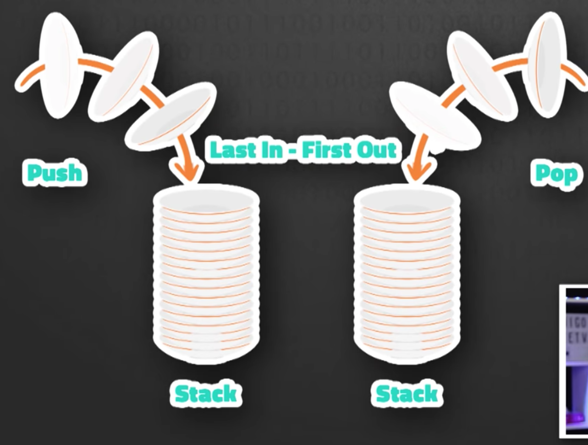
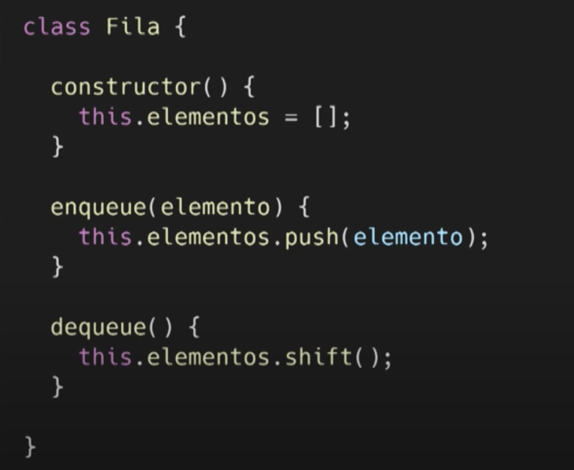
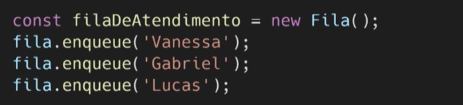
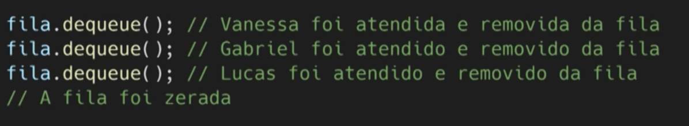
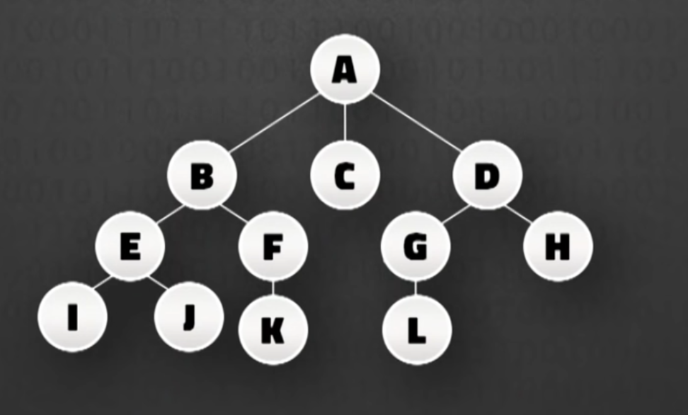
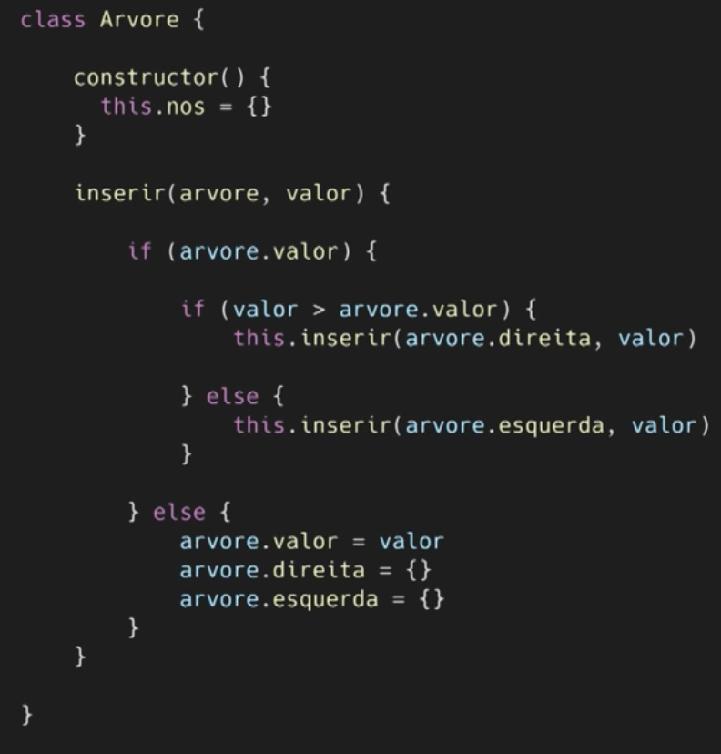
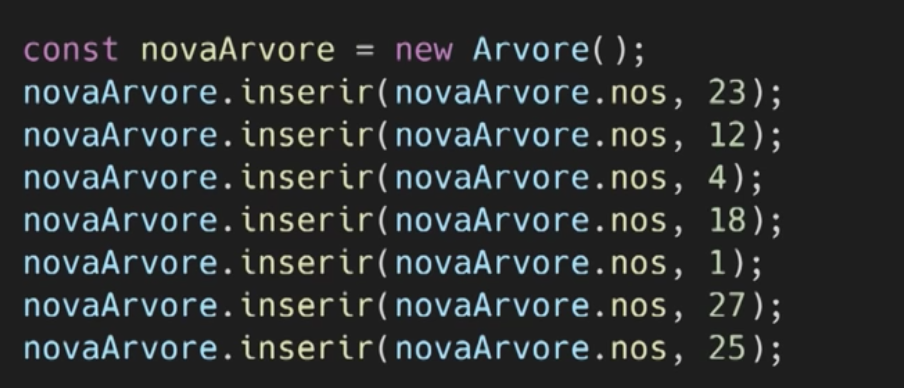
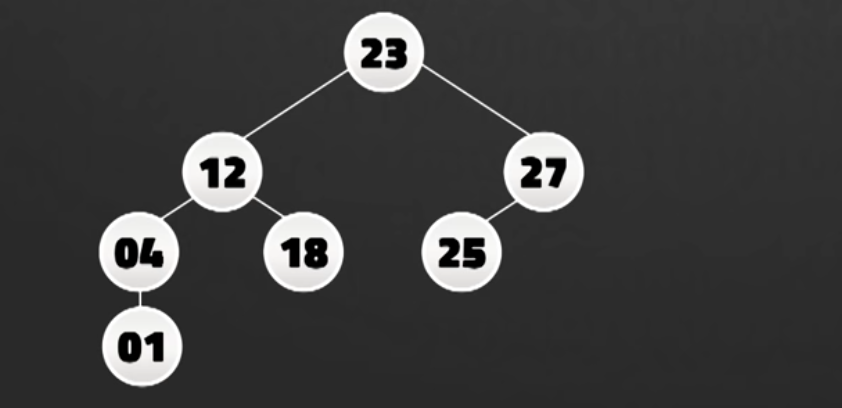

​​# :rocket: ESTRUTURA DE DADOS - ED

Abaixo contém um resumo básico em ```Ruby``` sobre ED, nos tópicos: Arrays, Matrizes, Pilhas, Filas, Árvores, Mapas e Conjuntos.


## 1 -  Array 

Consiste em armazenar coleção de elementos de um mesmo tipo. Eles podem ser identificados por pelo menos um índice ou chave.

1.1. <b>[] - Array Unidimensional</b> 

```
week_days = ['Segunda', 'Terça', 'Quarta', 'Quinta', 'Sexta', 'Sábado', 'Domingo']

puts(week_days[1]) // Terça
```

1.2. <b>[] - Array Multidimensional</b> 

```
users = [['Klark', 'Kent', 'Planeta Diário'],
    ['Joao', 'Do Pé', 'DevSoftware'],
    ['Mateus', 'Sousa', 'CongressoGC']]

 puts(users[1][2]) // DevSoftware
```

## 2 -  Pilha
Uma pilha é uma coleção ordenada de itens baseado no princípio ```L.I.F.O``` (Last In First Out). ```Ou seja, o último elemento a entrar na pilha é o primeiro a sair.```. 
Tanto a adição quanto a remoção dos itens da pilha acontece na mesma extremidade de da pilha, chamada ```"topo"```. A pilha é bem parecida com o Array, porém temos mais controle sobre adição e remoção dessa estrutura.

<div style="width: 70%;">

  
</div>

Exemplo: 

```
stack = []
stack << 2 # push 2 => stack = [2]
stack << 3 # push 3 => stack = [2, 3]
stack << 4 # push 3 => stack = [2, 3, 4]
stack.pop  # pop => 4, stack = [2, 3]

```
Um exemplo de pilha é quando você utiliza o ```Ctrl+Z``` e precisa recuperar o que digitou. 

## 3 -  Fila

A fila também é uma coleção ordenada de itens, o que as diferencia é o princípio que são baseados. A fila é baseada no conceito ```F.I.F.O``` (First In First Out). O primeiro a entrar é o primeiro a sair. Ele representa exatamente uma fila do banco real. A adição de novos itens é feita no fim da fila, que chamamos de Tail e a remoção é no início da fila, que é chamado de Head.

```Kafka e RabbitMQ``` são sistemas mensageria que usam o conceito de fila.

Exemplo em ruby: 
```
queue = Queue.new
queue << 2 # push 2 => queue = [2]
queue << 3 # push 3 => queue = [2, 3] 
queue << 4 # push 4 => queue = [2, 3, 4] 
queue.pop # pop 2
```

Exemplo em javascript: 

<div style="width: 60%;">


</div>

Agora adicionamos as pessoas a fila
<div style="width: 60%;">


<div>

Agora removemos as pessoas a fila
<div style="width: 100%;">


</div>

## 3 -  Árvore 
Diferente das estruturas mencionadas, a árvore é uma coleção não ordenada de itens. Um modelo abstrato de uma estrutura hierárquica. Árvore genealógica é um exemplo. 
As árvores são estruturas de dados constituídas de ```Nós```, em um relacionamento Pai e filho. O Nós mais alto no topo é chamado de ```Raiz```. No exemplo abaixo é o "A". 
- Cada Nó pode ter 0 (zero) ou mais filhos. 
- Além da raiz que fica no topo, os outros nós se dividem em nós internos (que possuem pelo menos 1 filho) e nós externos (também chamados de folhas. que não possuem nenhum filho)
- Nos Internos: B, E, F, G e D
- Nós Externos: I, J, K, C, L e H

<div style="width: 80%;">



</div>

Exemplo de árvores muito usado Árvore Binária e Árvore Binária de Busca, também chamado ```BST - Binary Search Tree```
- Árvore Binária: insere seus nós sem nenhuma regra definida.
- Árvore Binária de Busca: Inicia a operação inserindo a raiz e o 1 nó filho. A Partir do 2 nó, é feito uma verificação, se o novo nó tiver um valor maior que raiz, ele será adicionado a direita. Senão ele será adicionado à esquerda. Assim sabemos que os nós e subárvores da esquerda terão sempre valores menores do que os da direita. 

Exemplo: 

<div style="width: 70%;">


</div>

Instanciando valores a árvore:

<div style="width: 70%;">


</div>

Resultado visual:
<div style="width: 70%;">


</div>


## 4 -  Mapas

Exemplo em ruby

```
# Hash incase of ruby
a = {} (or a = Hash.new)
a['one'] = 1 # a = {"one"=>1}
a['two'] = 2 # a = {"one"=>1, "two"=>2}
```

## 5 -  Conjunto

Exemplo em ruby

```
s = Set.new         # <Set: {}>
s.add(1)            # <Set: {1}>
s.add(2)            # <Set: {1, 2}>
s.add(1)            # <Set: {1, 2}>
s.instance_of?(Set) # true
```

